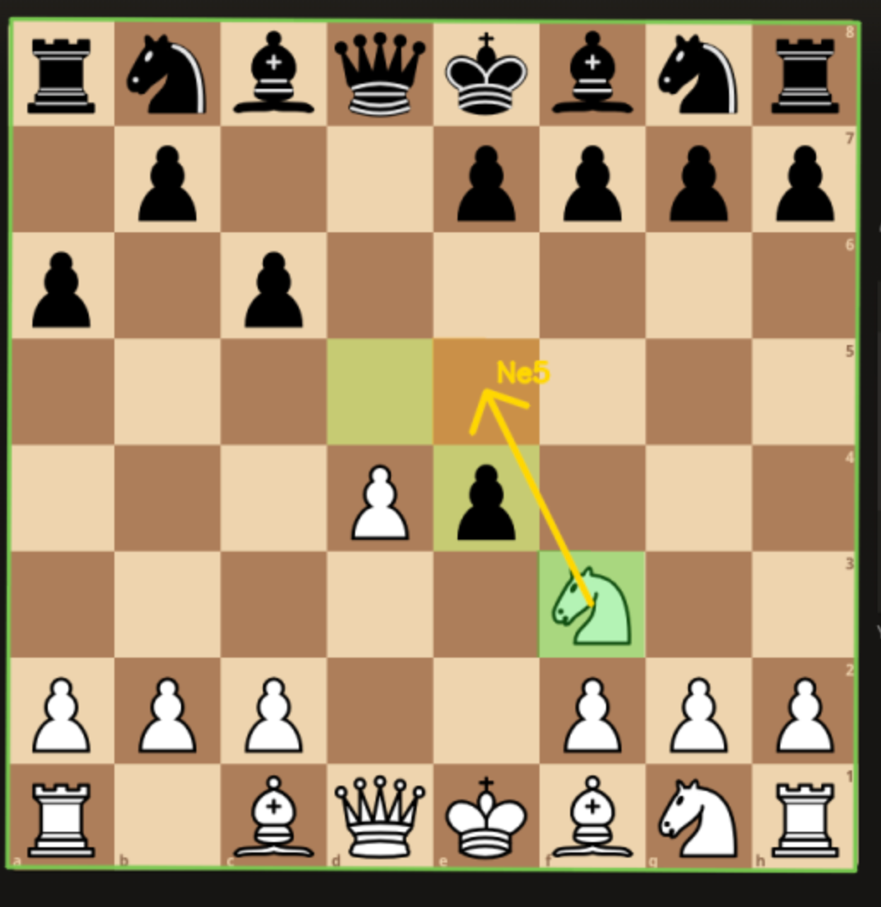
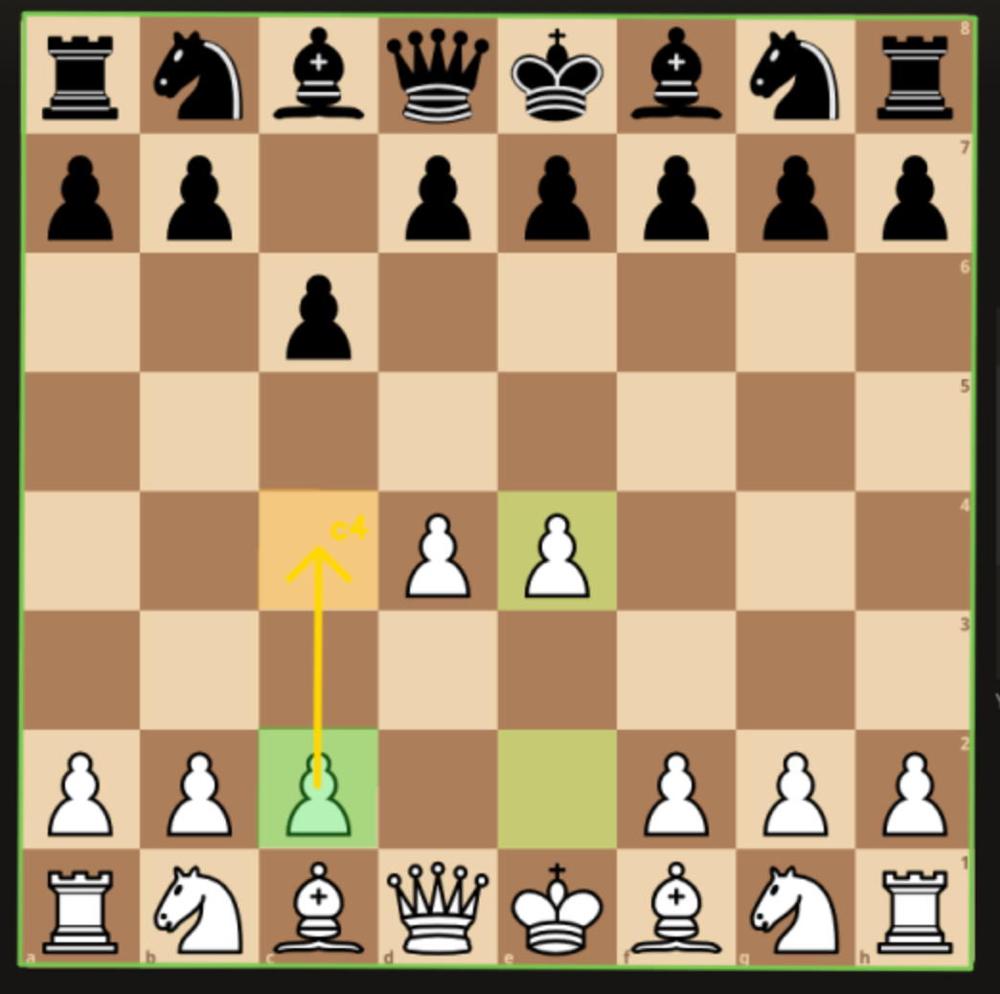
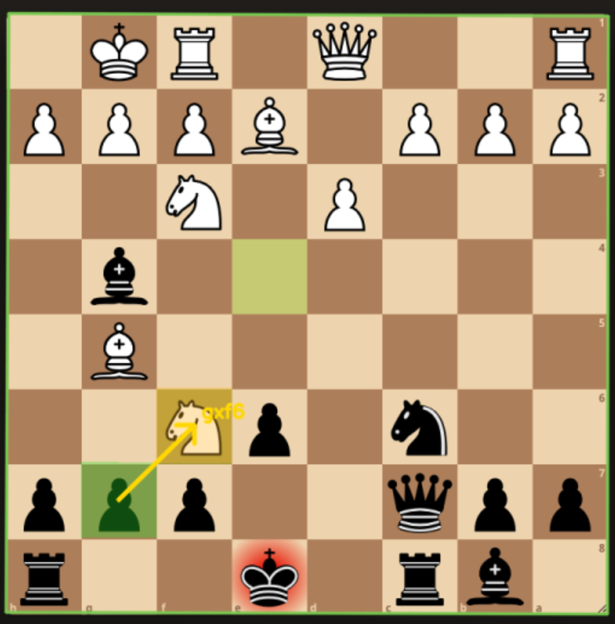

# Chess Boss

A chess master friend beat me at chess, so I decided to ask AI to build me something that could help me beat him at least once. Here are the results:

Guidance overlay while playing:








## Features

- Live screen capture (or a still image for debugging)
- Board detection + piece recognition from example-seeded templates
- Auto side / orientation detection (White or Black at the bottom)
- Stockfish best-move guidance with colored from/to squares + arrow
- Gaming-style HUD strip: FPS, board lock, side, turn, eval, FEN, engine status
- Multi-monitor picker (CLI + in-window chips / slider)
- Voice coaching — hear suggested and played moves (macOS `say`)
- Voice-only / headless mode — no window; audio + logs only
- Protocol logs under `logs/` for Stockfish or other UCI tools

## Setup

```bash
cd chess_boss
python3 -m venv .venv
source .venv/bin/activate
pip install -e .

# Engine (macOS)
brew install stockfish
```

Optional: `export STOCKFISH_PATH=/usr/local/bin/stockfish`

## Quick start

Calibrate piece templates from the example screenshot (done automatically on first run):

```bash
python -m chess_boss --calibrate
```

Dry-run against the example image (no screen capture):

```bash
python -m chess_boss --image examples/2026-08-11_13-42.png --always-guide
```

Live coaching (pick a screen with `--screen` / `-S`):

```bash
python -m chess_boss --list-screens
python -m chess_boss --screen 2 --side auto --depth 18
# aliases: --monitor / -m / -S
```

## Voice coaching

Chess Boss can announce moves out loud using the macOS `say` command (voice actors installed on your system).

### Voice-only (no window)

Run headless and just listen — useful when you do not want the preview overlay:

```bash
python -m chess_boss --list-voices
python -m chess_boss --voice-only --voice Samantha --screen 2 --depth 18
```

- No OpenCV window is created
- Suggested moves are spoken (e.g. “Play Knight to F 3”)
- Played moves on the board are spoken as they are detected
- Quit with `Ctrl+C`

### Window + voice

Keep the HUD and also hear announcements:

```bash
python -m chess_boss --speak --voice Daniel --screen 2 --depth 18
```

Choosing `--voice NAME` also enables speaking (even without `--speak`).

### Pick a voice actor

```bash
python -m chess_boss --list-voices
```

Examples of common English voices: `Samantha`, `Daniel`, `Albert`, `Karen`, `Fred`.

```bash
python -m chess_boss --voice-only --voice Daniel --voice-rate 140 --screen 1
python -m chess_boss --speak --voice "Flo (English (US))" --screen 2
```

Squares are spoken slowly and clearly (e.g. “Play … E … four” instead of a rushed “E4”). Use a lower `--voice-rate` if you still want it slower.

| Flag | Meaning |
|------|---------|
| `--voice-only` | Headless: no preview window; announce by voice only |
| `--voice NAME` | Voice actor / TTS voice (enables speaking) |
| `--list-voices` | List available TTS voices and exit |
| `--voice-rate WPM` | Speech rate (default `155`; lower = slower, try `130`–`140`) |
| `--voice-repeat SEC` | Re-say the suggestion every SEC if you haven’t moved (default `5`; `0`=off) |
| `--speak` | Enable voice while keeping the preview window |

## Keys & screen picker

The HUD has a SCREEN row with clickable monitor chips (`0:ALL`, `1:1920x1080`, …). There is also a `screen` slider at the top of the window.

| Key / control | Action |
|-----|--------|
| `q` | Quit |
| `r` | Reset game |
| `s` | Re-detect side |
| `[` / `]` | Previous / next screen |
| `0`–`9` | Jump to monitor index |
| click chip | Select that screen |
| `screen` slider | Select that screen |

## Useful flags

| Flag | Meaning |
|------|---------|
| `--screen N` / `-S` | Capture screen index (`0`=all, `1`=primary, …) |
| `--monitor N` / `-m` | Alias for `--screen` |
| `--list-screens` | Print available screens and exit |
| `--voice-only` | No preview window; announce moves by voice |
| `--voice NAME` | Voice actor (e.g. `Samantha`, `Daniel`) — enables TTS |
| `--list-voices` | Print available TTS voices and exit |
| `--voice-rate WPM` | Speech rate (default 155; lower = slower) |
| `--voice-repeat SEC` | Repeat suggestion every SEC if no move (default 5; 0=off) |
| `--speak` | Enable voice while keeping the preview window |
| `--region L T W H` | Crop capture to a rectangle |
| `--side white\|black\|auto` | Your color (`auto` detects board flip; works for Black at bottom) |
| `--always-guide` | Hint / speak even on opponent's turn |
| `--stockfish PATH` | Engine binary |
| `--depth N` / `--movetime MS` | Analysis strength |
| `--log-level DEBUG` | Verbose vision / UCI tracing |

## Logs

Every run writes a full audit trail under `logs/`:

| File | Contents |
|------|----------|
| `chess_boss.log` | Rolling app log (DEBUG detail, keep last ~5 files) |
| `<session>_session.log` | Per-run app log (same detail, one file per session) |
| `<session>_chain.log` | Human timeline: `BOARD → SIDE → MOVE → ENGINE → VOICE` |
| `<session>_moves.uci` | UCI tokens + FEN markers for Stockfish |
| `<session>_moves.pgn` | SAN move text |
| `<session>_events.jsonl` | Structured events (one JSON object per line) |

Example chain line:

```text
15:22:10 | BOARD      | side=white score=0.333 conf=0.955 fen=rnbqkbnr/pp2pppp/...
15:22:10 | ENGINE     | best=b1c3 depth=18 cp=42 pv_san=Nc3 d6 Qf3
15:22:10 | VOICE      | [Daniel] Play Knight to C three
15:22:14 | MOVE       | ply=3 UCI=b1c3 SAN=Nc3 → ...
```

Use `--log-level DEBUG` for verbose vision tracing on the console (files always keep DEBUG).

Replay a UCI session in Stockfish:

```text
position startpos moves e2e4 e7e5 g1f3
go depth 18
```

## Architecture

```text
capture/     screen grab (mss)
detection/   board find → templates → pieces → side
analysis/    move inference + advisor
engine/      Stockfish via python-chess UCI
overlay/     HUD + colored hints
voice/       TTS announcements (macOS say)
logging/     UCI / SAN protocol writers
```

Vision templates live in `assets/templates/` after calibration from `examples/`.

## Notes

- Recognition quality depends on board theme matching the example (classic Lichess brown). Re-run `--calibrate` with a fresh screenshot if you use another site/theme.
- For best results, keep the full board visible and avoid heavy overlapping windows.
- Voice coaching uses macOS `say`. List actors with `--list-voices`.
- This is a personal coaching / analysis aid — use it in line with the rules of whatever platform you play on.
